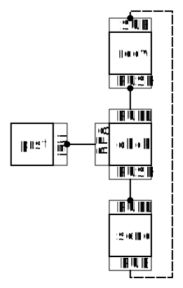

# SINPY

SINPY stands  for the PYthon version of a "Scalable Iota Node". It is supposed
to be an Iota Full Node consisting of multiple Python scripts which can
communicate with each other via [0MQ][1]. They can also communicate with
programs written in other languages to increase performance. These programs can
run on the same computer but they don't have to. They could also run on 10
Raspberry Pi Zeroes enabling an early form of Swarm nodes.

SINPY seperates all functions of an Iota Full Node into their own programs.
It does this for two reasons:
 * Code stays more readable and maintanable
   The code is indeed very understandable (for me) at the moment. But there
   are hardly any functions already implemented. Fingers crossed it will stay
   readable with the other functions. There are currently some "bad practices"
   in the code. I have to figure something out about how to remove them while
   still keeping the current simplicity. If you have any suggestions, I'd
   appreciate it, if you'd open an issue or made a pull request.
 * Scalability
   Because all features are seperate programs that communicate over 0MQ, they
   can be run on multiple computers.

## ESSICOs

Currently, there are 4 components implemented:
 * recv.py
   Receives transactions and forwards them to chck.
 * chck.py
   Checks basic properties of a transaction i.e. timestamp, PoW, duplicate
   If all properties are ok, it stores sends them to prst and send
 * prst.py
   Stores transactions. Currently in sqlite3 file. Could be replaced by
   scalable database.
 * send
   Forwards all transactions it gets to the "neighbors" (other SINPY nodes
   or IRI Nodes in the future).

I called these components "ESSential Iota COmponents".

They are connected to each other like this:

The REQ, REP, PUB, SUB, etc. represent 0MQ socket types. The components that
have a dot bind() the ones without a dot on their side connect().

Other components will/could include:
 * iri_recv.py
 * iri_send.py
 * Bundle Validation
 * Bundle Confirmation (Milestones, etc.)
 * Snapshots
 * Some kind of IXI-Module parser
 * REST-API
 * Pearldiver(s)

## How to "use"

SINPY can't even communicate with real Iota Full Nodes at this point in time
so it is kind of useless at the moment. But still: Here is how you can test it:

* Have Linux
* Have Python
* Have Pipenv
* Open up (at least) 6 terminal windows in the SINPY project root directory.
* Type `pipenv shell` into all of them.
* Type `python essico/setup.py` into one of them.
* Start one of each of these:
  * genesissender.py
  * recv.py
  * chck.py (you can start multiple of these)
  * prst.py
  * send.py
  * gpdb.py

  Look at Picture 1 to see the options you need to pass to the programs.

[Picture 1](https://raw.githubusercontent.com/za-uz/sinpy/master/how-to-use1.png)
[Picture 2](https://raw.githubusercontent.com/za-uz/sinpy/master/how-to-use2.png)
[Picture 3](https://raw.githubusercontent.com/za-uz/sinpy/master/how-to-use3.png)

If you have only one chck.py process started and you press Enter a lot on the
gensissender.py, you can see, that the chck cannot keep up.

---

If you have any questions about anything, feel free

---

Originally I started to write the "SIN" in C. Because it is literally
impossible to use argument parsers in C (if it were possible, I would've been
able to do it) and because I am not yet very good in C (definitely unrelated to
the first problem) I decided to prototype the whole thing in Python. Since the
individual components communicate via 0MQ, it is possible to gradually implement
C versions of them.

[1]: http://zeromq.org/
